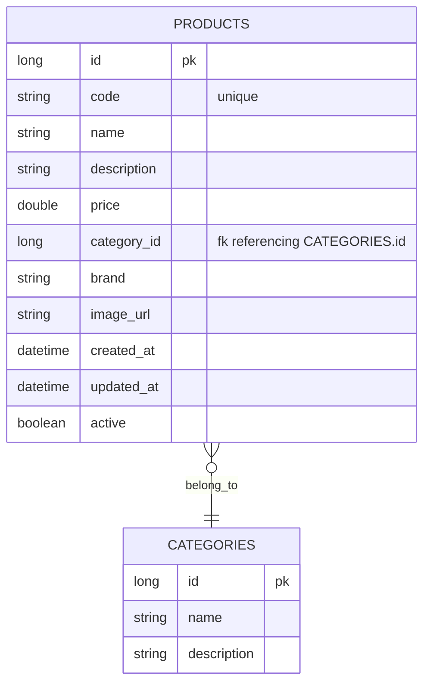
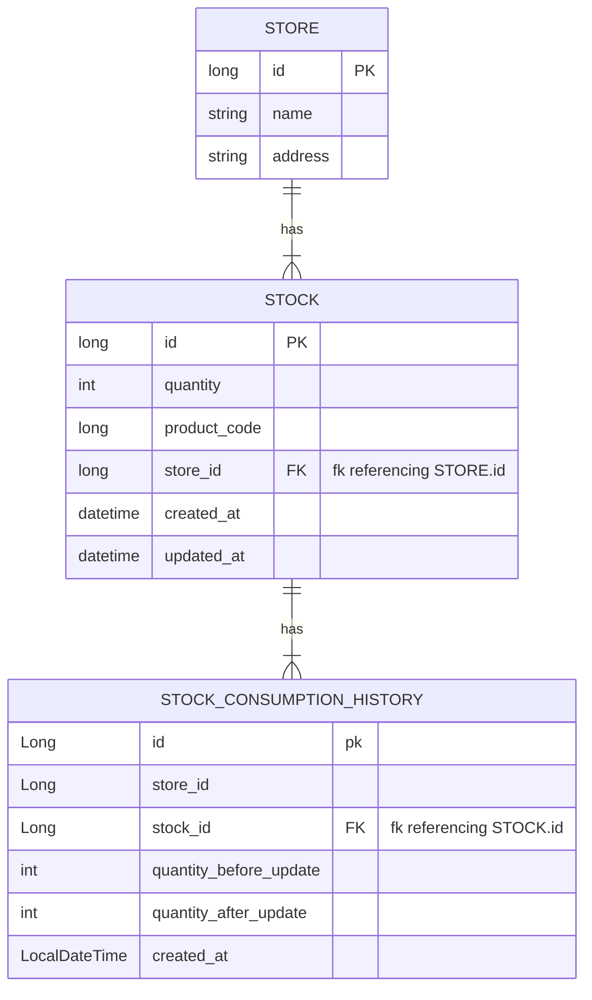
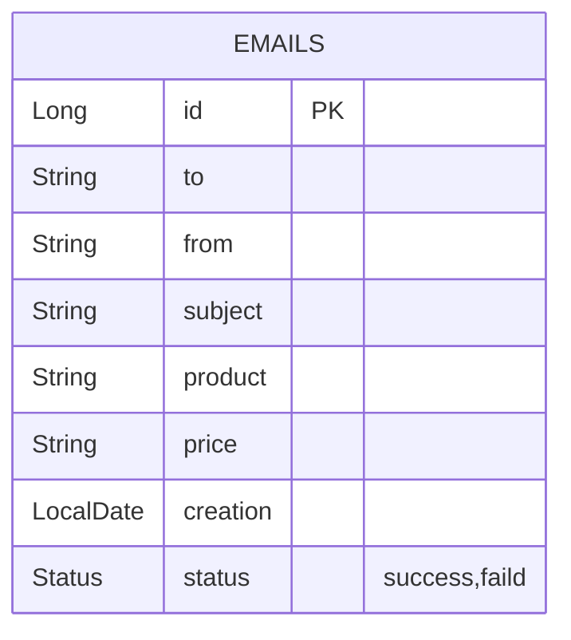
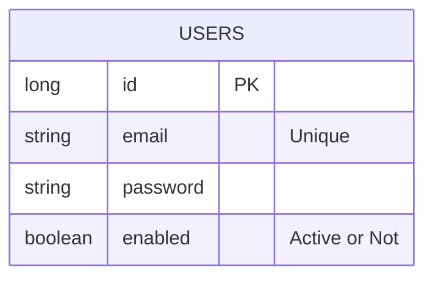

# 🛒 Ecommerce Project Systems Overview

Welcome to our Ecommerce project! Our platform consists of several interconnected systems, each serving a specific purpose to create a robust and efficient Ecommerce experience. Below is an overview of the systems integrated into our project:

## 🖥️ User Interfaces

### [🏦 Bank UI](https://github.com/Fawry-Internship/Bank-UI)
Experience intuitive banking with our user-friendly interface.

### [🛍️ Ecommerce UI](https://github.com/Fawry-Internship/Ecommerce-UI)
Immerse yourself in a visually stunning user interface designed to streamline navigation and enhance user engagement.

## 📡 APIs

### 💳 [Bank System](https://github.com/Fawry-Internship/Bank-API)
- **Functionality:**
  - Account Management: Handles creation and management of customer accounts.
  - Transaction Processing: Facilitates financial transactions such as deposits, withdrawals, and balance inquiries.
  - Security: Ensures secure authentication and authorization mechanisms for user accounts.

 ### ERD
```mermaid
erDiagram
    ACCOUNTS {
        Long id PK
        String card_number "Unique"
        String name 
        String email
        String password 
        double balance 
        boolean enable "Active or Not"
    }
     ACCOUNTS ||--o{ TRANSACTIONS : have
    TRANSACTIONS {
        Long id PK
        Long account_id FK "fk referencing ACCOUNTS.id"
        double amount
        String transaction_type
        LocalDateTime created_at
        String payment_method "credit card"
    }
  ```  

### 🎟️ [Coupon System](https://github.com/Fawry-Internship/Coupon-API)

- **Functionality:**
  - Coupon Generation: Generates unique discount codes with configurable usage limits and expiration dates.
  - Coupon Redemption: Allows customers to apply coupons during checkout to receive discounts on their orders.
  - Tracking: Logs coupon usage and provides reports on coupon effectiveness.

 ### ERD
```mermaid
 erDiagram
     COUPONS {
        long id PK
        string code "Unique"
        string discount_type "e.g., percentage, fixed amount"
        double discount_value
        datetime valid_from 
        datetime valid_to 
        int usage_limit
        int remaining_count
        datetime created_at 
    }
    COUPONS ||--o{ CONSUMPTION_HISTORY : has
    CONSUMPTION_HISTORY {
        long id PK
        datetime consumption_date 
        float discount_value
        long order_id 
        string customer_email
        long coupon_id FK "fk referencing  COUPONS.id"
    }
  ```


### 📦 [Order System](https://github.com/Fawry-Internship/Order-API)

- **Functionality:**
  - Order Management: Manages the lifecycle of orders from creation to fulfillment.
  - Inventory Control: Tracks product availability and updates inventory levels upon order placement.
  - Payment Processing: Handles payment transactions securely and ensures order completion upon successful payment.

  ### ERD
```mermaid
erDiagram
    ORDERS {
        long id PK
        long product_code
        string customer_email
        datetime order_date 
        double price
        string payment_method "(credit)"
        datetime created_at
        string coupon_code
    }
```


### 🛒 [Product System](https://github.com/Fawry-Internship/Product-API)

- **Functionality:**
  - Product Catalog: Maintains a comprehensive catalog of products available for sale.
  - Product Information: Stores detailed product information including descriptions, prices, and images.
  - Product Management: Supports CRUD operations for managing products within the catalog.

  ### ERD



### 🏪 [Store System](https://github.com/Fawry-Internship/Store-API)

- **Functionality:**
  - Store Management: Allows creation and management of storefronts or warehouses.
  - Product Display: Displays products within the store and enables browsing and search functionalities.
  - Inventory Management: Tracks stock levels and handles stock replenishment and adjustments.

  ### ERD


### 📬 [Notification System](https://github.com/Fawry-Internship/Notification-API)

- **Functionality:**
  - Notification Handling: Sends notifications to users regarding order status updates, promotions, and other relevant information.
  - Event Listening: Listens for events such as order placement, payment confirmation, and coupon redemption to trigger notifications.

  ### ERD


### 👤 [User System](https://github.com/Fawry-Internship/User-API)

- **Functionality:**
  - Manage Admin Users: Provides functionality to add, activate, and deactivate admin users.
  - View List of Users: Allows administrators to view a list of users for administrative purposes.

### ERD



## 🌟 Meet Our Team

<table>
  <tr>
    <td><br>Sameh Tarek</td>
    <td><br>Abdelrahman Reda</td>
    <td><br>Abdulrahman Naqeb</td>
    <td><br>Esraa Mabrouk</td>
    <td><br>Fouad Abdelhalim</td>
    <td><br>Hajar Refaat</td>
  </tr>
</table>
